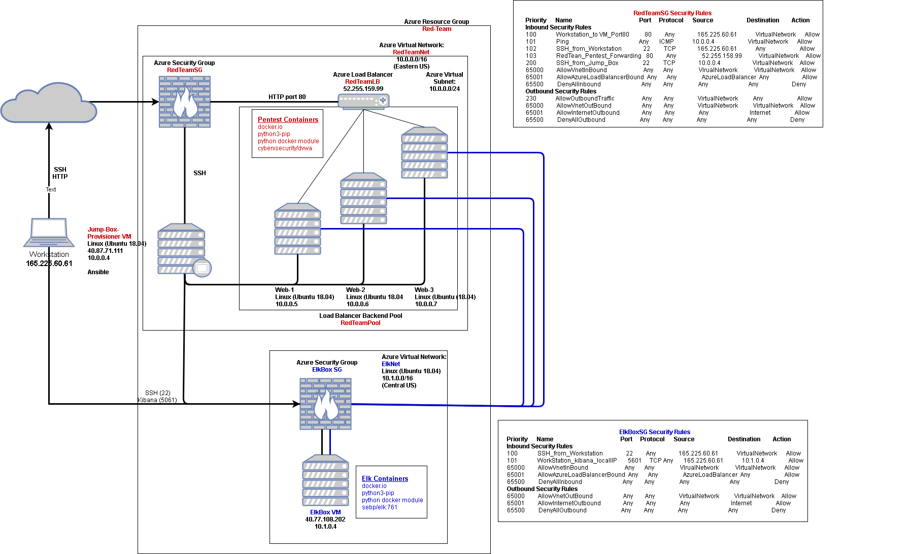

## Automated ELK Stack Deployment

The files in this repository were used to configure the network depicted below.

These files have been tested and used to generate a live ELK deployment on Azure. They can be used to either recreate the entire deployment pictured above. Alternatively, select portions of the ElkPlayBook.yml file may be used to install only certain pieces of it, such as Filebeat.

The ELK deployment in this network was performed with the Ansible/ElkPlaybook.yml file, executing from Jump Box Provisioner in the RedTeams Network.

This document contains the following details:
- Description of the Topology
- Access Policies
- ELK Configuration
  - Beats in Use
  - Machines Being Monitored
- How to Use the Ansible Build

### Description of the Topology

The main purpose of this network is to expose a load-balanced and monitored instance of DVWA, the D*mn Vulnerable Web Application.

Load balancing ensures that the DVWA application will be highly available, in addition to restricting access to the network.
Load balancers route client requests across multiple servers capable of fulfilling those requests.  They provide a single point to control access to the site.  
The use of the load balancer also allows each virtual  machine to be taken off-line, updated, and then restored to service without taking down the entire Red Team Network.

The DVWA virtual machines were populated using Ansible with the Ansible/PentestPlaybook.yml from Jump Box Provisioner.  This allows identical installations of on each of the virtual machines, and 
will allow for the duplication of additional virtual machines shoud they become necessary.

Integrating an ELK server allows users to easily monitor the vulnerable VMs for problems by centralizing logging with servers and applications.
Filebeat monitors log files on each VM, collects log events, and forwards them to Elasticsearch for indexing.
Metricbeat collects OS metrics for each VM status.

The configuration details of each machine may be found below.

| Name                 | Function | IP Address | Operating System   |
|----------------------|----------|------------|--------------------|
| Jump-Box-Provisioner | Gateway  | 10.0.0.4   | Linux Ubuntu 18.04 |
| Web-1                | DVWA VM  | 10.0.0.5   | Linux Ubuntu 18.04 |
| Web-2                | DVWA VM  | 10.0.0.6   | Linux Ubuntu 18.04 |
| Web-3                | DVWA VM  | 10.0.0.7   | Linux Ubuntu 18.04 |
### Access Policies

The machines on the internal network are not exposed to the public Internet. 

Only the Jump-Box-Provisioner machine (<JumpBoxProvisionerIpAddress>) can accept connections from the Internet. Access to this machine is only allowed from the following IP addresses:
- <myIpAddress> for RedAdmin access to the RedTeamNet.
- <RedTeamLoadBalancerIpAddr> for RedTeam Load Balancer

Machines within the network can only be accessed by using Jump-Box-Provisioner with a public IP address of <JumpBoxProvisionerOpAddress>.
The Intenet can access the DVWA VMs via the RedTeamLB load balancer, with a public IP address of <RedTeamLoadBalancerIpAddr>.

A summary of the access policies in place can be found in the table below.

RedTeamSG Security Rules
| Priority                 | Name                          | Port | Protocol | Source             | Destination    | Action |
|--------------------------|-------------------------------|------|----------|--------------------|----------------|--------|
Inbound  Security Rules  
| 100                      | Workstation_to_VM_Port80      | 80   | Any      | <myIpAddress>      | VirtualNetwork | Allow  |
| 110                      | Ping                          | Any  | ICMP     | 10.0.0.4           | VirtualNetwork | Allow  |
| 120                      | SSH_from_Workstation          | 22   | TCP      | <myIpAddress>      | Any            | Allow  |
| 130                      | Redteam_Pentest_Forwarding    | 80   | Any      | <redTeamIpAddress> | VirtualNetwork | Allow  |
| 200                      | SSH_from_JumpBox              | 22   | Any      | 10.0.0.4           | VirtualNetwork | Allow  |
| 65000                    | AllowVnetInbound              | Any  | Any      | VirtualNetwork     | VirtualNetwork | Allow  |
| 65001                    | AllowAzureLoadBalancerInbound | Any  | Any      | AzureLoadBalancer  | Any            | Allow  |
| 65500                    | DenyAllInbound                | Any  | Any      | Any                | Any            | Deny   |
Outbound  Security Rules 
| 200                      | Allow_Outbound_Traffic        | Any  | Any      | VirtualNetwork     | Any            | Allow  |
| 65000                    | AllowVnetOutbound             | Any  | Any      | VirtualNetwork     | VirtualNetwork | Allow  |
| 65001                    | AllowInternetOutbound         | Any  | Any      | Any                | Internet       | Allow  |
| 65500                    | DenyAllOutbound               | Any  | Any      | Any                | Any            | Deny   |
### Elk Configuration

Ansible was used to automate configuration of the ELK machine. No configuration was performed manually, which is advantageous because it becomes repeatable for large scale deployments.

The playbook implements the following tasks:
- Increase memory on the VM to 262144.
- Install docker.io
- Install python3-pip
- Install python docker module
- Install sebp/elk:761
- Enable docker service

The following screenshot displays the result of running `docker ps` after successfully configuring the ELK instance.
images/psShowingElkOnElkbox.png

### Target Machines & Beats
This ELK server is configured to monitor the following machines:
Web-1: 10.0.0.5
Web-2: 10.0.0.6
Web-3: 10.0.0.7

We have installed the following Beats on these machines:
Filebeat

Filebeat allows us to collect log files from each machine, and forward them to Elkbox.

### Using the Playbook
In order to use the playbook, you will need to have an Ansible control node already configured. Assuming you have such a control node provisioned: 

SSH into the control node and follow the steps below:
- sudo docker container list -a
- sudo docker start compassionate_shannon
- sudo docker attach compassionate_shannon
- cd to /etc/ansible
- Copy the ElkPlaybook.yml file to /etc/ansible.
- Update the hosts file to include:
[elk]
<local_IP_address_of_new_ELK_server> ansible_python_interpeter=/usr/bin/python3

- Run the playbook, and navigate to the <local_IP_address_of_new_ELK_server> to check that the installation worked as expected.

|ElkBoxSG Security Rules
| Priority                | Name                        | Port | Protocol | Source            | Destination    | Action |
|-------------------------|-----------------------------|------|----------|-------------------|----------------|--------|
| Inbound Security Rules  |                             |      |          |                   |                |        |
| 100                     | SSH_from_Workstation        |      |          | <myIpAddress>     | VirtualNetwork | Allow  |
| 110                     | Workstation_Kibana_LocalIIP | 5601 | TCP      | <myIpAddress>     | 10.1.0.4       | Allow  |
| 65000                   | AllowVnetInbound            | Any  | Any      | VirtualNetwork    | VirtualNetwork | Allow  |
| 65001                   | AllowAzureLoadBalancerBound | Any  | Any      | AzureLoadBalancer | Any            | Deny   |
| 65500                   | DenyAllInbound              | Any  | Any      | Any               | Any            | Deny   |
| Outbound Security Rules |                             |      |          |                   |                |        |
| 65000                   | AllowVnetOutbound           | Any  | Any      | VirtualNetwork    | VirtualNetwork | Allow  |
| 65001                   | AllowInternetOutbound       | Any  | Any      | Any               | Internet       | Allow  |
| 65500                   | DenyAllOutbound             | Any  | Any      | Any               | Any            | Deny   |
### Exploring Kibana
Answer the following Questions:

- In the last 7 days, how many unique visitors were located in India?
There were 231 unique vistors from India in the last seven days.

- In the last 24 hours, of the visitors from China, how many were using Mac OSX?
In the last 24 hours, eleven unique visitors from China were using Mac OSX.

- In the last 2 days, what percentage of visitors received 404 errors? How about 503 errors?
I was able to generate the table, but could not determine how to provide percentages for the error codes with the time I had.

- In the last 7 days, what country produced the majority of the traffic on the website?
In the last seven days, the majority of traffic was produced by China.

- Of the traffic that's coming from that country, what time of day had the highest amount of activity?
The highest traffic from China was at hour 12.

- List all the types of downloaded files that have been identified for the last 7 days, along with a short description of each file type
rpm = RPM Package Manager, an open source package manager.
deb = standard Unix archive format containing two zipped files, one for the installer control information, and the other for the installable files.
zip = an archive file format that supports lossless compression.
css = Cascading Style Sheets is a style sheet for presentation of a document written in a markup language.
gz = gnu zipped file format.

#### Unique Visitors vs Average Bytes
- Locate the time frame within the last 7 days with teh most amount of bytes
28 March 2021 21:00 to 29 March 2021 00:00 had the most bytes with three visitors

- In your own words, is there anything that seems potentially strange about this activity?
three users had the highest number of average bytes.

- What is the timestamp of the event
The largest download occured at 22:00 on 28 March 2021.  It was the download of a 15.3 kilobyte rpm file.

I was able to trace the visitor to India.

DISCOVERY did not yield any additional information for this event.